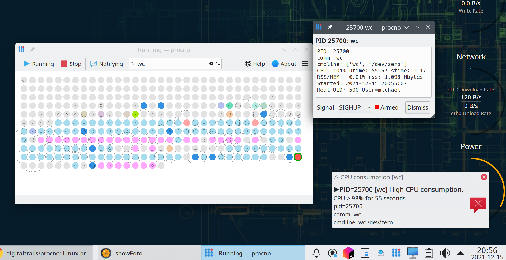

Procno: Process monitor and notifications forwarder
===================================================

A desktop process monitor with Freedesktop-Notifications forwarding. **Like "top", but not as we know it.**

https://user-images.githubusercontent.com/5510901/142822739-f18e98d2-8ab1-42ca-97c6-ead17191bcba.mp4

***This code is hot of the presses.  Features may change on a daily basis.***  That said, the code is 
usually quite functional, I don't push it here unless I think it's solid.  I've had some success using it to 
detect runaway processes, such as chrome suddenly deciding to burn a CPU continuously.  Feedback is welcome.

Description
-----------

 

An explanation the video or screenshot:

 * All the processes on the system are represented by dots.
 * The static dot coloring is specific to the process owner (all the light grey processes belong to root).
 * If a process consumes a little CPU (<10%) its dot will briefly light up in blue.
 * If a process consumes a lot of CPU its dot will vary from lighter pinkish-red to full-red depending on how much
   CPU it is consuming.
 * If a dot briefly enlarges or decreases in size, the process's resident set size has gone up or down.
 * Each process dot is augmented with a dashed-ring that indicates the processes resident set size as proportion of RAM.
 * If text is entered in the search field (for example nmb), any process with matching text is circled
   (this happens dynamically, so new matching processes will be circled when they start).  Text search becomes
   incremental once more than three characters have been entered.
 * Hovering over a dot brings up a tooltip containing process details.
 * Clicking on a dot brings up a small dialog with processed details that update dynamically.  The dialog
   includes an arming switch (a checkbox) that arms a signal dropdown which can be used to signal/terminate
   the process.
 * If a process consumes too much CPU or RSS for too long, a desktop notification will be raised. The notification
   will continue to update as long as the process continues to offend.  If the notification is closed, no  
   no further notifications will be raised while the process continues to offend.  When a processed ceases
   to offend its notification status is reset, any subsequent offending will result in fresh notifications.
 * Procno can optionally run out of the system tray. Geometry and configuration is preserved
   across restarts. Procno dynamically adjusts to light and dark desktop themes.

Procno is designed to increase awareness of background activity.  Possibilities for it use include:

 * Detecting runaway processes, either CPU or RAM.
 * Getting a quick overview of where resources are going.
 * Looking for patterns in resource consumption.
 * Identifying unnecessary services that are present and idle.
 * Entertaining the cat.
 
Optional metrics
----------------
Procno can optionally report some other process metrics:

  * USS: unique set size, this should more accurately reflect memory consumption, but it appears to be
    very expensive to collect, procno's CPU consumption jumps from around 8% to 50% if USS stats
    are enabled. In respect to my own desktop, RSS is pretty similar to USS for the applications
    that consume the bulk of most memory.  Another issue with USS is that access to USS is limited,
    USS will only be shown for your own processes.
  * Shared memory: this is inexpensive to report but is not confined to RSS or USS, so may not be
    a good indicator of pressure on the system.
  * I/O: this is a basic indicator of whether read/write occurred in the last period.  Most processes
    are continually doing some amount of I/O, so perhaps this is not that useful, although a
    continuous-on indicator may be an indication of pressure in some circumstances.  Access to
    I/O read/write counts is restricted, I/O indicators will only be shown for your own processes.


Getting Started
---------------


To get started with ``procno``, you only need to download the ``procno.py`` python script and
check that the dependencies described below are in place. 


Dependencies
------------

All the following runtime dependencies are likely to be available pre-packaged on any modern Linux distribution 
(``jouno`` was originally developed on OpenSUSE Tumbleweed).

* python 3.8: ``jouno`` is written in python and may depend on some features present only in 3.8 onward.
* python 3.8 QtPy: the python GUI library used by ``jouno``.
* python 3.8 psutils: the library used to gather the data (often preinstalled in many Linux systems)
* python 3.8 dbus: python module for dbus used for issuing notifications
* Freedesktop theme icons: these are normally installed by default on any Linux desktop.
  The application may look different under different desktop themes. It was developed on a 
  system that is set to the OpenSUSE Tumbleweed default theme. 

Dependency installation on ``OpenSUSE``::

        zypper install python38-QtPy python38-dbus-python

Installing
----------

As previously stated, the ``procno.py`` script is only file required beyond the prerequisites. There
are also **OpenSUSE** and **Fedora** rpm's available at: [https://software.opensuse.org/package/procno](https://software.opensuse.org/package/procno)


The current options for installation are the following:

1. The script can be run without installation by using a python interpreter, for example:
   ```
   % python3 procno.py
   ```
2. The script can be self installed as desktop application in the current user's desktop menu 
   as *Applications->System->procno* by running:
   ```
    % python3 procno.py --install
   ```
   Depending on which desktop you're running menu changes may require logout before they become visible.

3. A system-wide installation, download the RPM from the above link, then use rpm to install it:
   ```
   sudo rpm --install procno-1.0.3-3.1.noarch.rpm
   ```
   The rpm will install the following files:
   ```
    /usr/bin/procno
    /usr/share/applications/procno.desktop
    /usr/share/icons/procno.png
    /usr/share/licenses/procno
    /usr/share/licenses/procno/LICENSE.md
   ```


Executing the program
---------------------

* If installed by the current user via the ``--install`` option, ``procno`` should be in
  the current user's application menu under **System**. The ``procno`` command will be in ``$HOME/bin``.
  If ``$HOME/bin`` is on the user's ``PATH``, ``procno`` will be able to be run from the command
  line:
  ```
  % procno
  ```
* If the script has not been installed, it can still be run on the command line via the python interpreter, 
  for example:
  ```
  % python3 procno.py
  ```

Help
----

Detailed help can be accessed by using the help button or tray context-menu or --help on the 
command line.  Access to the context-menu is available via the menu on the application-window 
and right-click on the system-tray icon.

Accessories
-----------

A suggested accessory is [KDE Connect](https://kdeconnect.kde.org/).  If you enabled the appropriate permissions on 
your phone, KDE Connect can forward desktop notifications to the phone.  Use procno to forward alert 
messages to Desktop-Notifications, and use KDE Connect to forward them to your phone.


Issues
------

KDE kwin-compositing has an ongoing CPU/responsiveness issue for notifications that are set to expire ([bug 436240](https://bugs.kde.org/show_bug.cgi?id=436240)).
If this proves to be a problem, the ``procno`` option notification_seconds can be set to zero, in 
which case popup messages won't expire and will remain visible until dismissed (this may be an nvidia only issue).  

Development
-----------

At this time there is only one real source file, ``procno.py``

My IDE for this project is [PyCharm Community Edition](https://www.jetbrains.com/pycharm/).

My development Linux desktop is [OpenSUSE Tumbleweed](https://get.opensuse.org/tumbleweed/). The python3
interpreter and python3 libraries are from the standard OpenSUSE Tumbleweed repositories (Tumbleweed currently
defaults python3 to [python 3.8](https://www.python.org/downloads/release/python-380/)).

Authors
-------

Michael Hamilton\
``m i c h a e l   @  a c t r i x   .   g e n  . n z``


Version History
---------------

``procno`` is currently still in development. It is feature complete and quite functional, but no formal release 
has been made.


License
-------

This project is licensed under the **GNU General Public License Version 3** - see the [LICENSE.md](LICENSE.md) file 
for details

**Procno Copyright (C) 2021 Michael Hamilton**

This program is free software: you can redistribute it and/or modify it
under the terms of the GNU General Public License as published by the
Free Software Foundation, version 3.

This program is distributed in the hope that it will be useful, but
WITHOUT ANY WARRANTY; without even the implied warranty of MERCHANTABILITY
or FITNESS FOR A PARTICULAR PURPOSE. See the GNU General Public License for
more details.

You should have received a copy of the GNU General Public License along
with this program. If not, see <https://www.gnu.org/licenses/>.

## Acknowledgments

* [pyqt](https://riverbankcomputing.com/software/pyqt/)
* [Freedesktop Notifications](https://specifications.freedesktop.org/notification-spec/latest/ar01s09.html)
